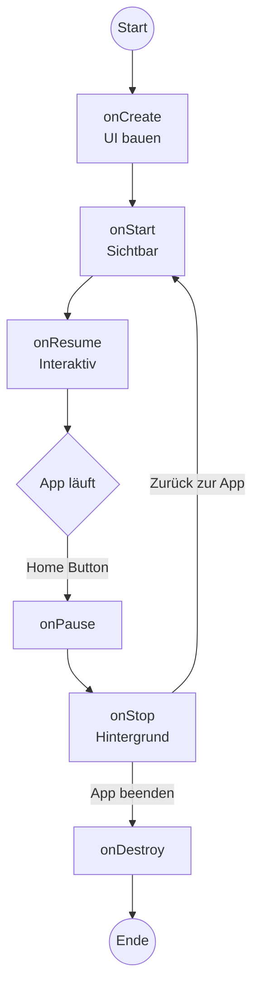
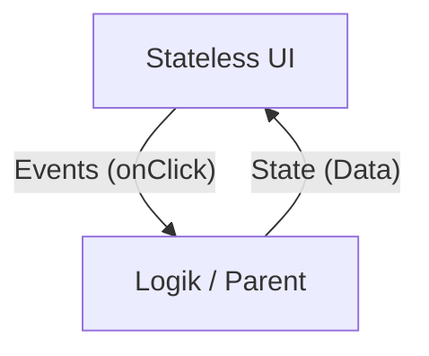
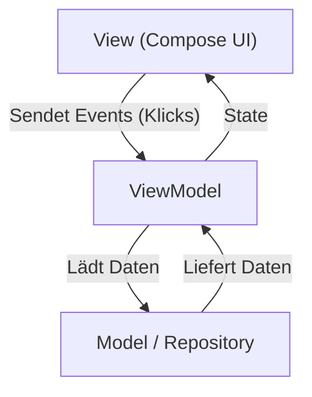
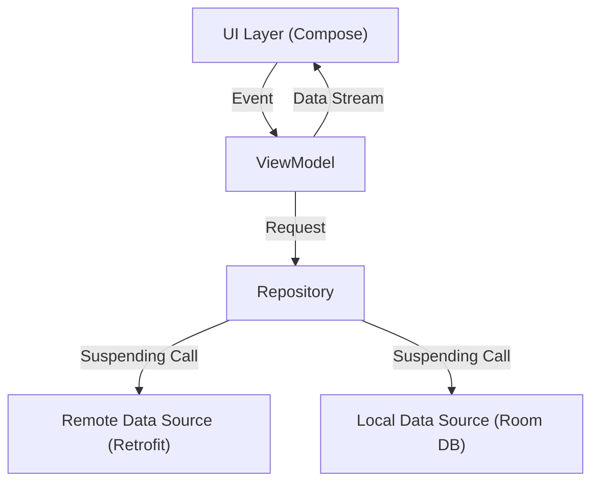
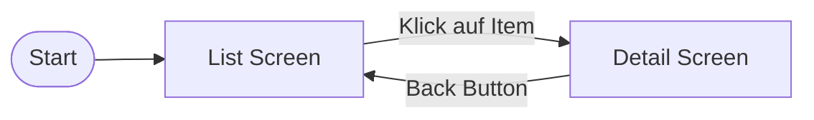

# Workshop: Einführung in die Moderne Android Entwicklung

## Einführung

Bevor wir starten, klären wir die Frage: **Warum tun wir uns das an?** Warum lernen wir einen komplett neuen Tech-Stack (Kotlin & Compose), wenn Java & XML seit 10 Jahren funktionieren?

### 1. Warum Kotlin?
Kotlin ist seit 2019 die von Google bevorzugte Sprache für Android.

*   **Weniger Code:** Kotlin ist drastisch knapper als Java. Keine Semikolons, keine `new` Keywords, Data Classes in einer Zeile.
*   **Null Safety:** Der "Billion Dollar Mistake" (NullPointerException) wird durch das Typsystem fast eliminiert. Der Compiler zwingt uns, an `null` zu denken.
*   **Interoperabilität:** Kotlin funktioniert zu 100% mit Java. Wir können alte Java-Libraries nahtlos weiternutzen.
*   **Modern Features:** Coroutines (für Asynchronität) und Lambdas machen komplexen Code lesbar.

### 2. Warum Jetpack Compose?
Compose ist das moderne, deklarative UI-Toolkit von Google.
*Hinweis: Das klassische View-System (XML) wird weiterhin unterstützt, aber neue Features erscheinen primär nur noch für Compose.*

*   **Deklarativ vs. Imperativ:** Statt Views zu *manipulieren* (`textView.setText(...)`), beschreiben wir den *Zustand*. Früher waren Layout (XML) und Logik (Java/Kotlin) getrennt, was oft zu Fehlern zur Laufzeit führte (z.B. falsche IDs, NullPointer). Compose vereint beides typsicher in einer Sprache.
*   **100% Kotlin:** Kein Kontext-Wechsel mehr zwischen XML und Java/Kotlin. Die UI ist Code. Wir haben die volle Macht der Sprache (Schleifen, If-Else) im Layout.
*   **Unbundled:** Compose ist eine Library, nicht Teil des Android OS. Das heißt: Bugs werden sofort gefixt, ohne dass der User auf ein Android-Update warten muss.
*   **Weniger Code & Dateien:** Eine `RecyclerView` brauchte früher Adapter, ViewHolder und mehrere XML-Layouts. In Compose ist eine Liste oft nur ein einziger Funktionsaufruf (`LazyColumn`).

---

## Unser Projekt: Rick & Morty Charakter Guide

Wir lernen nicht trocken. Wir bauen gemeinsam eine echte App!
**Die App:** Ein Guide, der Charaktere aus der TV-Serie "Rick & Morty" anzeigt.

**Features, die wir bauen:**
1.  **Liste:** Scrollbare Liste aller Charaktere mit Bildern.
2.  **Details:** Detailansicht mit Status (Alive/Dead), Spezies und Herkunft.
3.  **Netzwerkanbindung:** Echtes Datenladen von der `rickandmortyapi.com`.
4.  **Architektur:** Saubere Trennung mit MVVM, Repository und StateFlow.

Am Ende des Workshops haben wir eine fertige, installierbare App auf unserem Handy.

---

## Modul 1: The Kotlin Foundation

### 1.1 Variablen: Warum `final` der Standard ist

**Das Problem (früher):**
In Java und älteren Sprachen sind Variablen standardmäßig veränderbar. Das führt zu Fehlern, wenn Daten an einer Stelle geändert werden, wo man es nicht erwartet (Side Effects). Gerade bei Multi-Threading oder UI-Updates ist das tödlich.

**Die Lösung (Kotlin):**
Kotlin zwingt uns, eine bewusste Entscheidung zu treffen. Wir unterscheiden strikt zwischen "ReadOnly" und "Mutable".

* **`val` (Value):** Read-only. Einmal zugewiesen, nie mehr geändert.
* **`var` (Variable):** Mutable. Der Wert kann sich ändern.

```kotlin
// Recommended: read-only (the default)
val shopName = "Needful Things"
// shopName = "Wallmart" // Compile error!

// Only if needed: mutable
var itemsInCart = 0
itemsInCart = 1 // Allowed
```

> **Faustregel:**
> **Definiere immer alles zuerst als `val`.**
> Erst wenn der Compiler meckert, weil wir einen Wert später ändern *müssen* (und wir uns sicher sind, dass das logisch richtig ist), ändern wir es zu `var`.

**Warum ist das wichtig?**
Moderne UIs (wie Compose) führen Funktionen sehr oft und parallel aus. Wenn wir mit normalen `var` Variablen arbeiten würden, wäre das Verhalten unvorhersehbar. In Compose nutzen wir daher `val` fast überall.


---

### 1.2 Null Safety: Der Milliarden-Dollar-Fehler

**Das Problem (Java):**
Jedes Objekt kann theoretisch `null` sein. `String name = null;` ist valider Code. Ein Zugriff `name.length()` führt zum Absturz (`NullPointerException`).

**Die Lösung (Kotlin):**
Kotlin unterscheidet im Typsystem zwischen Typen, die `null` sein dürfen (`String?`), und solchen, die es nicht dürfen (`String`). Das zwingt uns, Fehler zur *Compile-Zeit* zu behandeln.

**Werkzeuge für den Umgang mit Null:**

1. **Safe Call Operator (`?.`)**: "Führe den Zugriff nur aus, wenn das Objekt da ist."
```kotlin
val length = character?.length // 'length' ist Int? (nullable)
```

2. **Elvis Operator (`?:`)**: "Wenn null, nimm diesen Default-Wert."
```kotlin
val length = character?.length ?: 0 // 'length' ist Int (nicht null)
```

**Scope Functions (`.let`):**
Oft wollen wir einen Code-Block nur ausführen, wenn eine Variable nicht null ist. Dafür gibt es `.let`.

```kotlin
val imageUrl: String? = ...

// Only run if imageUrl is NOT null
imageUrl?.let { url ->
    // Inside here 'url' is guaranteed non-null
    loadImage(url)
}
```
*`let` ist eine Standard-Funktion, die das Objekt nimmt, den Block ausführt und das Ergebnis zurückgibt. In Kombination mit `?.` ist es der perfekte "If-Not-Null" Block.*


---

### 1.3 Funktionen: Default Arguments

**Das Problem (Java):**
Um Parameter optional zu machen, mussten wir Methoden überladen (Overloading).

**Die Lösung (Kotlin):**
Wir definieren Standardwerte direkt in der Funktion.

```kotlin
fun createUser(
    name: String,
    isActive: Boolean = true, // Default value
    role: String = "User"     // Default value
)

// Calls:
createUser("Rick") // Uses defaults for isActive & role
createUser("Morty", false) // Overrides isActive
```

### 1.4 Funktionen: Named Arguments

**Das Problem:**
Aufrufe mit vielen Parametern sind unleserlich: `drawRect(10, 20, true, false, true)`. Was bedeuten diese Booleans?

**Die Lösung:**
Wir benennen die Parameter beim Aufruf. Die Reihenfolge ist dann egal!

```kotlin
createUser(
    name = "Rick",
    role = "Admin"
    // isActive is skipped and stays true
)
```

**Warum ist das für Compose wichtig?**
UI-Elemente haben dutzende Eigenschaften. Dank Named Arguments geben wir nur das an, was wir ändern wollen:
```kotlin
Text(text = "Hallo", color = Color.Red)
```


---

### 1.5 Lambdas: Funktionen als Daten

**Das Problem (Java):**
Wir wollen Code definieren, der "später" ausgeführt wird (z.B. bei Klick). In Java brauchten wir dafür Interfaces (Listeners).

```java
// Java — lots of boilerplate for little logic
button.setOnClickListener(new OnClickListener() {
    @Override
    public void onClick(View v) {
        System.out.println("Clicked!");
    }
});
```

**Die Lösung (Kotlin):**
Funktionen sind Variablen. Wir können Code-Blöcke (Lambdas) speichern und übergeben.

**Definition:** `val name = { parameter -> code }`

```kotlin
// A lambda that takes two Ints and returns an Int
val sum = { a: Int, b: Int -> 
    a + b 
}

val result = sum(2, 3) // 5
```

### 1.6 Trailing Lambda Syntax

Das ist die Syntax, die Compose möglich macht.
Wenn der *letzte* Parameter einer Funktion ein Lambda ist, darf man es *außerhalb* der Klammern schreiben.

```kotlin
// A function expecting 'data' and an 'action'
fun doSomething(data: String, action: () -> Unit) { ... }

// Option A: inside the parens (hard to read)
doSomething("Data", { println("Done") })

// Option B: trailing lambda (clean)
doSomething("Data") {
    println("Done")
}
```

**Compose Context:**
Layouts wie `Column` sind einfach Funktionen, die ein Lambda als letzten Parameter nehmen (den `content`).

```kotlin
Column {          // Das hier ist das Trailing Lambda!
    Text("Oben")  // Der Inhalt
    Text("Unten")
}
```


### 1.7 Mehrere Lambdas

Wenn eine Funktion **mehrere Lambdas** erwartet, können wir die Trailing Lambda Syntax nicht sauber nutzen. Hier sollten wir immer **Named Arguments** verwenden, um den Code lesbar zu halten.

**Definition:**
```kotlin
fun ComplexButton(
    text: String,
    onClick: () -> Unit,
    onLongClick: () -> Unit
) { ... }
```

**Aufruf (Sauber):**
```kotlin
ComplexButton(
    text = "Klick mich",
    onClick = { 
        println("Klick!") 
    },
    onLongClick = { 
        println("Langer Klick!") 
    }
)
```

---

## Modul 2: Hello Jetpack Compose

### 2.1 Basics: Activity & Lifecycle

Bevor wir UI bauen (Composables), müssen wir verstehen, *wo* sie lebt.

**Die Activity:**
Eine `Activity` ist der Einstiegspunkt jeder Android App (ähnlich der `main()` Funktion, aber mit Fenster). Sie repräsentiert einen Screen.
Jedes Projekt beginnt mit einer `MainActivity`, die von `ComponentActivity` erbt.

**Single Activity Architecture:**
Früher hatte jeder Screen eine eigene Activity. Das war schwerfällig und langsam.
Heute nutzen wir **eine einzige** Activity (`MainActivity`) als Container und tauschen darin nur die Composables aus (siehe Modul 11: Navigation).

**Der Lifecycle (Lebenszyklus):**
Wir kontrollieren nicht, wann unsere App startet oder stirbt. Das macht das Android System.



**Das "Rotation Problem":**
Wenn wir das Handy drehen (Konfigurationsänderung), wird die Activity **zerstört und komplett neu erstellt** (`onDestroy` -> `onCreate`).
*Das Problem:* Alle lokalen Variablen (`var count = 0`) gehen dabei verloren!
*(Die Lösung lernen wir in Modul 7: ViewModel).*

### 2.2 Deklaratives UI vs. Imperatives UI

**Vergleich: Ein Button mit Text**

**Der alte Weg (XML + Java):**
Man definiert die View in XML und sucht sie im Java-Code, um sie zu verändern.

```xml
<!-- layout.xml -->
<Button
    android:id="@+id/myButton"
    android:layout_width="wrap_content"
    android:layout_height="wrap_content" />
```

```java
// Java / Kotlin (imperative)
Button button = findViewById(R.id.myButton);
button.setText("Klick mich");
button.setOnClickListener(v -> {
    button.setText("Geklickt!");
});
```

**Der neue Weg (Compose):**
UI und Logik sind eins. Der Zustand (`clicked`) bestimmt, was gezeichnet wird.

```kotlin
// Kotlin (declarative)
@Composable
fun MyButton() {
    var clicked by remember { mutableStateOf(false) }
    
    Button(onClick = { clicked = true }) {
        Text(if (clicked) "Geklickt!" else "Klick mich")
    }
}
```

> **Merksatz:** UI ist eine Funktion des Zustands.
> **UI = f(State)**

### 2.3 Layout Basics: Row & Column


In Compose werden Elemente standardmäßig **übereinander gestapelt** (wie in einer `Box` oder `FrameLayout`). Um sie nebeneinander oder untereinander anzuordnen, nutzen wir Layout Composables.

**1. Verschachtelung (Nesting):**
Hier ein einfaches Beispiel ohne Zusatz-Parameter. Eine `Row` innerhalb einer `Column`.

```kotlin
Column {
    Text("Oben")
    
    // A row INSIDE the column
    Row {
        Text("Links")
        Text("Rechts")
    }
    
    Text("Unten")
}
```

**2. Positionierung (Arrangement & Alignment):**
Um Elemente präzise zu platzieren, nutzen wir Parameter der Layouts. (Hinweis: `modifier` lernen wir im nächsten Abschnitt).

**Column (Y-Achse)**
```kotlin
Column(
    verticalArrangement = Arrangement.Center, // Zentriert den Inhalt vertikal
    horizontalAlignment = Alignment.CenterHorizontally // Zentriert den Inhalt horizontal in der Breite
) {
    Text("Mitte")
}
```

**Row (X-Achse)**
```kotlin
Row(
    horizontalArrangement = Arrangement.SpaceBetween, // Verteilt Platz zwischen Start und Ende
    verticalAlignment = Alignment.CenterVertically // Zentriert Elemente in der Höhe
) {
    Text("Start")
    Text("Ende")
}
```

**Wichtige Parameter:**
*   **Arrangement (Anordnung):** Steuert die Verteilung auf der *Hauptachse* (Column: Y, Row: X).
    *   `Arrangement.Center`: Alles in die Mitte.
    *   `Arrangement.SpaceBetween`: Platz gleichmäßig zwischen den Elementen verteilen.
    *   `Arrangement.spacedBy(8.dp)`: Fester Abstand von 8dp zwischen Elementen.
*   **Alignment (Ausrichtung):** Steuert die Position auf der *Querachse* (Column: X, Row: Y).
    *   `Alignment.Start` / `Alignment.End`: Links/Rechts bzw. Oben/Unten.
    *   `Alignment.CenterHorizontally` / `Alignment.CenterVertically`: Zentriert.

**3. Box (Stapel - Z-Achse)**
Legt Elemente übereinander. Das letzte Element im Code liegt visuell ganz "oben".

```kotlin
Box(contentAlignment = Alignment.BottomEnd) {
    Image(...)      // Hintergrundbild
    Text("Caption") // Text darüber (unten rechts)
}
```

### 2.4 Der Modifier

Der `Modifier` ist das mächtigste Werkzeug in Compose. Er erlaubt uns:
1.  Größe & Layout verändern (`width`, `height`, `padding`)
2.  Aussehen anpassen (`background`, `border`, `clip`)
3.  Interaktionen hinzufügen (`clickable`, `scrollable`)
4.  Metadaten setzen (`testTag`, `semantics`)

**Ketten-Prinzip (Chaining):**
Modifier-Funktionen geben immer einen neuen Modifier zurück. Wir hängen Aufrufe aneinander:
`Modifier.fillMaxWidth().padding(16.dp).background(Color.Red)`

**Wichtig: Die Reihenfolge zählt!**
Ein Modifier "wickelt" das Element (und vorherige Modifier) ein.

**Beispiel: Background vs. Clip**

```kotlin
// 1. Background first (red), then clip (circle)
// Result: a red square! The clip applies only to the content drawn after it, not to the red background drawn before.
Modifier
    .background(Color.Red)
    .clip(CircleShape)

// 2. Clip first (circle), then background (red)
// Result: a red circle! The background is drawn inside the clip's shape.
Modifier
    .clip(CircleShape)
    .background(Color.Red)
```

> **Tipp:** Die Änderungen werden von außen nach innen angewendet.

**Dokumentation:**
Eine vollständige Liste aller Modifier ist in der offiziellen Dokumentation zu finden: [developer.android.com/develop/ui/compose/modifiers](https://developer.android.com/develop/ui/compose/modifiers)

### 2.5 Previews: Visuelles Feedback ohne Emulator

**Das Problem:**
Jedes Mal die App neu zu bauen und auf dem Emulator zu starten, um eine kleine UI-Änderung zu sehen, dauert ewig (Gradle Build, Install...).

**Die Lösung (@Preview):**
Wir können Composables direkt in Android Studio in der "Split"-Ansicht (Design) sehen, ohne die App zu starten.

```kotlin
@Preview(showBackground = true, name = "My First Preview")
@Composable
fun MyButtonPreview() {
    MaterialTheme {
        MyButton()
    }
}
```

**Vorteile:**
1.  **Schnelles Feedback:** Änderungen sind fast sofort sichtbar.
2.  **Mehrere Zustände:** Wir können mehrere Previews für dieselbe Komponente erstellen (z.B. Light Mode, Dark Mode, Große Schrift).
3.  **Interaktiv:** Im "Interactive Mode" können wir sogar Buttons klicken.

---

### 2.6 Ressourcen: Das R-System

In Android hardcoden wir keine Texte oder Pfade zu Bildern. Wir nutzen das "Resource System".
Alle Dateien im Ordner `res/` werden automatisch kompiliert und über die Klasse `R` verfügbar gemacht.

**Warum?**
1.  **Übersetzungen:** Wir können `values-de/strings.xml` und `values-en/strings.xml` anlegen. Android wählt automatisch die richtige Sprache!
2.  **Organisation:** Alles liegt sauber getrennt vom Code.
3.  **Konstanten:** Der Compiler prüft, ob die Ressource existiert. Keine Tippfehler mehr!

**Zugriff in Compose:**

*   **Strings (`res/values/strings.xml`):**
    ```xml
    <string name="app_name">Rick & Morty</string>
    <string name="hello">Hallo Welt</string>
    ```
    ```kotlin
    Text(text = stringResource(R.string.hello))
    ```

*   **Bilder (`res/drawable/`):**
    ```kotlin
    Image(
        painter = painterResource(R.drawable.my_logo),
        contentDescription = stringResource(R.string.company_logo)
    )
    ```

---

## Modul 3: Listen & Performance

### 3.1 Datenmodellierung: Die `data class`

Bevor wir Listen bauen können, brauchen wir ein **Datenmodell**: eine Beschreibung, wie ein einzelner Eintrag aussieht. In Kotlin nutzen wir dafür eine `data class`.

**Was macht eine `data class` besonders?**
Eine normale Klasse müsste man für sauberen Vergleich, Logging und Kopien manuell mit `equals()`, `hashCode()`, `toString()` und `copy()` ausstatten. Die `data class` generiert all das automatisch — wir geben nur die Properties an.

```kotlin
data class Character(
    val id: Int,
    val name: String,
    val status: String,
    val imageUrl: String
)
```

**Was uns Kotlin geschenkt hat:**
*   **`equals()` & `hashCode()`:** Zwei `Character` mit gleichen Werten gelten als gleich (wichtig für Listen-Vergleiche und Compose-Recomposition).
*   **`toString()`:** `Character(id=1, name=Rick, ...)` — perfekt für Logging.
*   **`copy()`:** Neue Instanz mit geänderten Feldern, ohne den Rest manuell durchzureichen.

```kotlin
val rick = Character(1, "Rick Sanchez", "Alive", "...jpg")
val rickAsFavorite = rick.copy(isFavorite = true) // Nur ein Feld geändert
```

**Faustregel:**
> Alles, was nur Daten transportiert, ist eine `data class`.
> Properties bevorzugt als `val` — Unveränderlichkeit verhindert Bugs bei Compose-Recomposition.

**Dummy-Daten als Hilfsfunktion:**
Während wir noch keine echte API haben, geben wir uns Test-Daten direkt im Code:

```kotlin
fun getDummyCharacters(): List<Character> = listOf(
    Character(1, "Rick Sanchez", "Alive", "https://rickandmortyapi.com/api/character/avatar/1.jpeg"),
    Character(2, "Morty Smith", "Alive", "https://rickandmortyapi.com/api/character/avatar/2.jpeg"),
)
```

### 3.2 LazyColumn: Listen performant anzeigen

**Warum nicht einfach eine `Column`?**
Eine `Column` rendert **alle** ihre Kinder sofort. Bei 5 Items ist das okay. Bei 1000 Items wird die App langsam und stürzt eventuell ab (Out of Memory), weil alle 1000 Views gleichzeitig im Speicher gehalten und gezeichnet werden, auch wenn nur 5 sichtbar sind.

**Die Lösung: `LazyColumn`**
Die `LazyColumn` rendert nur die Elemente, die gerade auf dem Bildschirm sichtbar sind. Wenn wir scrollen, werden die alten Elemente recycelt und für neue Daten wiederverwendet. Das ist extrem speichereffizient und schnell.

```kotlin
val characters = listOf("Rick", "Morty", "Summer", "Beth")

LazyColumn {
    // 1. Static content (once)
    item {
        Text("My character list", fontSize = 24.sp)
    }

    // 2. Dynamic list (repeated)
    items(characters) { name ->
        Text(text = name, modifier = Modifier.padding(16.dp))
    }
}
```

**Wichtige Konzepte:**
*   **LazyListScope:** Die Funktionen `item` und `items` gibt es nur innerhalb des `LazyColumn`-Blocks.
*   **item { ... }:** Fügt ein einzelnes Composable hinzu (z.B. Header, Footer).
*   **items(list) { ... }:** Iteriert über eine Liste und erstellt für jeden Eintrag ein Composable.

### 3.3 Custom Items: Modularisierung & Wiederverwendbarkeit

Statt riesige Code-Blöcke in der `LazyColumn` zu schreiben, lagern wir das UI für einen einzelnen Eintrag in ein eigenes Composable aus (`CharacterItem`).

**Vorteile:**
1.  **Wiederverwendbarkeit:** Wir können das Item an verschiedenen Stellen nutzen.
2.  **Lesbarkeit:** Der Code der Liste bleibt sauber und übersichtlich.
3.  **Trennung:** Die Liste kümmert sich um das "Scrollen", das Item um das "Aussehen".

```kotlin
@Composable
fun CharacterItem(name: String, status: String) {
    // Simple layout for our card
    Row(
        modifier = Modifier
            .fillMaxWidth()
            .padding(8.dp)
            .background(Color.LightGray) // Temporary background
            .padding(16.dp)
    ) {
        // Image placeholder
        Box(modifier = Modifier.size(60.dp).background(Color.DarkGray))
        
        Spacer(modifier = Modifier.width(16.dp))
        
        Column {
            Text(text = name, fontSize = 20.sp)
            Text(text = status, fontSize = 14.sp)
        }
    }
}
```

**Verwendung in der Liste:**

```kotlin
LazyColumn {
    items(characterList) { char ->
        CharacterItem(name = char.name, status = char.status)
    }
}
```

---

## Modul 4: Theming & Design System

### 4.1 Theming: Konsistentes Design & Dark Mode

**Das Ziel:**
Wir wollen ein **einheitliches Erscheinungsbild** (Farben, Schriften, Formen) in der gesamten App.
Würden wir jedem `Text` und jedem `Button` einzeln Farben via Modifier geben, hätten wir zwei Probleme:
1.  **Duplizierter Code:** Änderungen am Design müssten an 100 Stellen gemacht werden.
2.  **Dark Mode:** Wenn das Handy von Tag auf Nacht umschaltet (System-Einstellung), müsste der Code manuell darauf reagieren. Das wäre extrem fehleranfällig und aufwendig.

**Die Lösung (Material Theme):**
Wir definieren unsere Design-Regeln an **einer zentralen Stelle**. Das Theme ist eine Funktion, die am Start der App aufgerufen wird und automatisch auf System-Einstellungen reagiert.

```kotlin
@Composable
fun RickAndMortyTheme(
    // Auto-detects: is the system in dark mode?
    darkTheme: Boolean = isSystemInDarkTheme(),
    content: @Composable () -> Unit
) {
    // Auto-picks the matching color scheme
    val colorScheme = if (darkTheme) DarkColorScheme else LightColorScheme

    MaterialTheme(
        colorScheme = colorScheme,
        typography = Typography,
        content = content
    )
}
```

**Nutzung im Code:**
Wir nutzen *niemals* feste Farben (`Color.Red`), sondern beziehen uns auf die *Rolle* der Farbe im Theme.

```kotlin
// Wrong (hardcoded):
Text("Hallo", color = Color.Black) // Stays black even in dark mode (invisible on dark surface!)

// Correct (semantic):
Text("Hallo", color = MaterialTheme.colorScheme.onSurface) // Adapts automatically
```

> **Dokumentation:**
> Eine Übersicht aller Material Design Tokens (Farben, Typografie) ist hier zu finden: [m3.material.io](https://m3.material.io)

### 4.2 Die App-Struktur: Scaffold

Damit unsere App wie eine echte Android App aussieht (Status Bar, TopBar, Floating Action Button), nutzen wir das `Scaffold` ("Baugerüst").

**Das Konzept: Slots API**
Das Scaffold stellt uns vordefinierte Bereiche ("Content Slots") zur Verfügung (z.B. `topBar`, `bottomBar`, `floatingActionButton`).
Das Scaffold kümmert sich um die **Positionierung** (Layout) dieser Komponenten. Wir müssen nur den **Inhalt** (das Composable) liefern.

```kotlin
Scaffold(
    topBar = { 
        CenterAlignedTopAppBar(title = { Text("Rick & Morty") }) 
    }
) { innerPadding ->
    // IMPORTANT: innerPadding must be passed to the content!
    // Otherwise our content disappears behind the TopBar.
    Box(modifier = Modifier.padding(innerPadding)) {
        // Our screen content goes here
        CharacterList()
    }
}
```

### 4.3 Cards: Inhalte gruppieren

Für Listeneinträge nutzen wir oft eine `Card`. Sie bietet Schatten (Elevation) und abgerundete Ecken und passt sich farblich automatisch dem Theme an (`SurfaceVariant`).

```kotlin
Card(
    modifier = Modifier.fillMaxWidth().padding(8.dp),
    onClick = { /* click event */ } // Cards are clickable!
) {
    // Card content (e.g., a row with image and text)
    Row(
        modifier = Modifier.padding(16.dp),
        verticalAlignment = Alignment.CenterVertically
    ) {
        // Example image
        Box(modifier = Modifier.size(50.dp).background(Color.Gray, CircleShape))
        
        Spacer(modifier = Modifier.width(16.dp))
        
        Column {
            Text("Rick Sanchez", style = MaterialTheme.typography.titleMedium)
            Text("Alive", style = MaterialTheme.typography.bodyMedium)
        }
    }
}
```

---

## Modul 5: Bilder laden (Images & Networking Basics)

**Die Herausforderung:**
Fast jede moderne App muss Bilder aus dem Internet anzeigen. Das ist komplexer als es klingt:
1.  **Netzwerk:** Daten müssen geladen werden (dauert Zeit).
2.  **Asynchronität:** Das darf nicht auf dem Haupt-Thread passieren (sonst friert die UI ein).
3.  **Performance:** Bilder müssen gecached und skaliert werden.

**Die Lösung (Coil):**
Wir nutzen die Library **Coil** (Coroutines Image Loader). Sie ist der Standard für Compose, erledigt das Threading im Hintergrund und ist extrem einfach zu nutzen.

**Setup (build.gradle.kts):**
`implementation(libs.coil.compose)` *(Details siehe Anhang A)*

**Verwendung:**
Wir ersetzen den Platzhalter-Box durch ein echtes Bild.

```kotlin
AsyncImage(
    model = "https://rickandmortyapi.com/api/character/avatar/1.jpeg",
    contentDescription = "Rick Sanchez",
    modifier = Modifier.size(60.dp).clip(CircleShape),
    
    error = painterResource(R.drawable.error)
)
```

**Lade-Anzeige (Progress & Content Slots):**
Manchmal reicht ein einfaches Platzhalter-Bild nicht. Wir wollen vielleicht einen Lade-Kringel (Spinner) anzeigen oder eine komplexes Fehler-Layout.
Dafür nutzen wir `SubcomposeAsyncImage`. Es bietet uns **Content Slots** (Bereiche), in denen wir eigene Composables für die verschiedenen Zustände definieren können.

```kotlin
SubcomposeAsyncImage(
    model = "https://rickandmortyapi.com/api/character/avatar/1.jpeg",
    contentDescription = stringResource(R.string.character_image_description),
    modifier = Modifier.size(60.dp).clip(CircleShape),
    
    // Slot for the loading state (shown while the image is loading)
    loading = {
        CircularProgressIndicator(modifier = Modifier.padding(20.dp))
    },
    
    // Slot for errors (e.g., bad URL or no internet)
    error = {
        Icon(Icons.Default.Error, contentDescription = "Error")
    }
)
```

> **Dokumentation:**
> Mehr Infos zu Coil gibt es hier: [coil-kt.github.io/coil/compose](https://coil-kt.github.io/coil/compose/)

*Hinweis: Mehr zum Thema "Threading" und warum wir den Haupt-Thread nicht blockieren dürfen, lernen wir in Modul 8*

---

---

## Modul 6: State Management

### 6.1 Unidirectional Data Flow: Das Ende des Spaghetti-Codes

**Das Problem (Views & MVC):**
Views hatten früher ihren eigenen State. Eine `CheckBox` wusste selbst, dass sie "checked" ist. Wenn wir den State im Code (Controller) geändert haben (`checkBox.isChecked = true`), mussten wir beides synchron halten.
Wenn State an mehreren Orten liegt (in der View, im Fragment, im Singleton), entsteht "Spaghetti-State" und inkonsistente Bugs.

**Die Lösung (Unidirectional Data Flow - UDF):**
State fließt nur in eine Richtung (von oben nach unten). Events fließen in die andere (von unten nach oben).
Die UI "weiß" nichts mehr. Sie zeigt nur an, was sie bekommt.

**Wichtigste Regel:** UI ist zustandslos (Stateless).

### 6.2 `remember` und `mutableStateOf`

Wenn sich in Compose der State ändert, wird die Funktion neu aufgerufen (Recomposition).
Lokale Variablen gehen also bei jedem Re-Draw verloren!

**Das Problem:**
```kotlin
var count = 0 // Reset to 0 on every recomposition!
Button(onClick = { count++ }) {
   Text("Count: $count") 
}
// Display stays "Count: 0" forever
```

**Die Lösung (`remember`):**
Wir müssen Compose sagen: "Merk dir diesen Wert über Recompositions hinweg!"

```kotlin
// remember: keep this value across recompositions.
// mutableStateOf: notify Compose when the value changes.
var count by remember { mutableStateOf(0) }

Button(onClick = { count++ }) {
   Text("Count: $count") // When count changes, the UI re-renders!
}
```

### 6.3 State Hoisting: Teile und Herrsche

Composables sollen oft wiederverwendbar sein. Wenn sie aber ihren eigenen State (`remember`) haben, sind sie schwer zu testen und von außen zu steuern.

**Pattern: State Hoisting (Zustand hochheben)**
Wir ziehen den State aus der Funktion heraus in die Parameter.

**Vorteile:**
1.  **Wiederverwendbarkeit:** Die Komponente kann überall genutzt werden.
2.  **Einfaches Testen & Preview:** Da wir keine Abhängigkeiten haben, können wir `CounterContent` einfach in einer `@Preview` mit festen Werten anzeigen.

Die Funktion bekommt zwei Dinge als Parameter:
1.  **State (T):** Was soll angezeigt werden?
2.  **Event ((T) -> Unit):** Was soll passieren, wenn der User interagiert?



```kotlin
// Stateful composable (owns internal state — good for screens)
@Composable
fun CounterScreen() {
    var count by remember { mutableStateOf(0) }
    
    // Calls the stateless version
    CounterContent(
        count = count,
        onIncrement = { count++ }
    )
}

// Stateless composable (dumb & reusable)
@Composable
fun CounterContent(count: Int, onIncrement: () -> Unit) {
    Button(onClick = onIncrement) {
        Text("Geklickt: $count mal")
    }
}
```

---

## Modul 7: The ViewModel & MVVM

### 7.1 Die Architektur: MVVM

Wir trennen unsere App in drei Schichten (Model - View - ViewModel), um den Code sauber und testbar zu halten.

*   **Model:** Die Daten (z.B. User, Character). Weiß nichts von der UI.
*   **View (Compose):** Zeigt die Daten an. Weiß *wie* es aussieht, aber nicht *woher* Daten kommen.
*   **ViewModel:** Der Vermittler. Hält den State, überlebt Konfigurationsänderungen (Drehen des Handys) und kommuniziert mit Layers darunter (Repository).



### 7.2 Der UI State: Warum eine eigene Klasse?

Wir könnten im ViewModel einfach drei Variablen haben: `isLoading`, `data`, `errorMessage`.
Aber was passiert, wenn `isLoading = true` UND `data != null` ist? Wir haben inkonsistente Zustände.

**Die Lösung: Sealed Interface (UiState)**
Ein `sealed interface` definiert eine **geschlossene Menge** an möglichen Zuständen. Die UI kann immer nur in **genau einem** dieser Zustände sein.

```kotlin
sealed interface UiState {
    // 1. Loading: no data yet, just a spinner
    data object Loading : UiState
    
    // 2. Success: we have data (the list)
    data class Success(val characters: List<Character>) : UiState
    
    // 3. Error: something went wrong (message)
    data class Error(val message: String) : UiState
}
```

**Das Datenmodell (Character):**
```kotlin
data class Character(val name: String, val status: String)
```

**Der Vorteil: Exhaustive When & Smart Casts**
Wenn wir im Code ein `when(state)` machen, **zwingt** uns der Compiler, alle Fälle (Loading, Success, Error) zu behandeln. Wir können keinen Zustand vergessen!

Zusätzlich macht Kotlin einen **Smart Cast**. Im `is UiState.Success` Block weiß der Compiler automatisch, dass `state` vom Typ `Success` ist, und wir können direkt auf `state.data` zugreifen – ohne manuelles Casten!

```kotlin
when (state) {
    is UiState.Loading -> ShowSpinner()
    is UiState.Success -> ShowList(state.characters) // .characters is accessible here!
    is UiState.Error -> ShowError(state.message) // .message is accessible here!
}
```

### 7.3 StateFlow: Der State-Container

Wir brauchen einen Container im ViewModel, der den aktuellen Zustand hält und der UI Bescheid sagt, wenn sich etwas ändert. Dafür nutzen wir `StateFlow`.

**Warum StateFlow?**
*   Es ist immer ein aktueller Wert da (Initial Value).
*   Es ist "Thread-Safe".
*   Es passt perfekt zu Compose.

**Implmentierung:**

```kotlin
class CharacterViewModel : ViewModel() {
    
    // 1. Internal mutable state (we can change it)
    private val _uiState = MutableStateFlow("Lade Daten...")
    
    // 2. Public immutable state (the UI is read-only!)
    val uiState: StateFlow<String> = _uiState.asStateFlow()

    fun loadData() {
        // Simulate a network call
        _uiState.value = "Rick Sanchez"
    }
}
```

### 7.4 Side Effects: `LaunchedEffect`

In Compose dürfen wir **niemals** Logik oder Datenbank-Aufrufe direkt im Composable-Body machen.
Warum? Composables können hunderte Male pro Sekunde neu ausgeführt werden. Wir würden unsere API DDoS-en!

**Die Lösung:**
Wir brauchen einen sicheren Ort für "Seiteneffekte" (Side Effects), der nur **einmal** ausgeführt wird (oder wenn sich ein Key ändert).

```kotlin
@Composable
fun CharacterScreen(viewModel: CharacterViewModel = viewModel()) {
    // Converts the Flow into Compose state
    val state by viewModel.uiState.collectAsStateWithLifecycle() 
    
    Text(text = "Name: $state")
    
    // IMPORTANT: API calls belong in an effect!
    // Unit as the key means: "run this block exactly ONCE on first composition."
    LaunchedEffect(Unit) {
        viewModel.loadData()
    }
}
```

> **Hinweis:** `collectAsStateWithLifecycle()` benötigt die `androidx.lifecycle:lifecycle-runtime-compose` Dependency.
> **Dokumentation:** [developer.android.com/develop/ui/compose/state](https://developer.android.com/develop/ui/compose/state)

### 7.5 Der Kreis schließt sich: UI State konsumieren

Wie reagiert die UI nun auf die verschiedenen Zustände? Mit unserem Sealed Interface und `when` ist das extrem sauber:

```kotlin
@Composable
fun CharacterScreen(state: UiState) {
    when (state) {
        is UiState.Loading -> {
            // Show loading indicator
            CircularProgressIndicator(modifier = Modifier.align(Alignment.Center))
        }
        is UiState.Error -> {
            // Show error message
            Text("Fehler: ${state.message}", color = MaterialTheme.colorScheme.error)
        }
        is UiState.Success -> {
            // Show the list
            LazyColumn {
                items(state.characters) { character ->
                    CharacterItem(character)
                }
            }
        }
    }
}
```

---

## Modul 8: Asynchronität & Coroutines

### 8.1 Coroutines: Async einfach gemacht

**Das Problem (Main Thread & Callbacks):**
Der "Main Thread" ist für das Zeichnen der UI zuständig. Wenn wir hier ein Netzwerk-Request starten (dauert 2 Sekunden), "friert" die App ein -> ANR (Application Not Responding).
Früher nutzten wir `AsyncTask` oder Callback-Höllen, um Arbeit in den Hintergrund zu schieben.

**Die Lösung (Coroutines & Suspend):**
Wir schreiben Code, der asynchron aussieht, sich aber wie sequentieller Code liest. Das Schlüsselwort ist `suspend`.
Eine `suspend fun` kann "pausiert" werden, ohne den Thread zu blockieren.

**Der Scope:** Coroutinen brauchen einen "Lebensraum" (Scope).
Im ViewModel nutzen wir `viewModelScope`. Wenn das ViewModel stirbt (Screen geschlossen), werden alle laufenden Requests automatisch abgebrochen!

> **Faustregel:**
> **Asynchrone Operationen und Logik gehören ins ViewModel!**
> Starte niemals Coroutinen direkt im Composable (`rememberCoroutineScope` ist nur für UI-Events wie Scrollen gedacht).

```kotlin
// Inside the ViewModel:
fun loadData() {
    viewModelScope.launch { 
        // We're asynchronous now
        val result = api.getData() // Suspends here, but does NOT block the thread
        _uiState.value = result    // Continues afterwards
    }
}

// A suspend function:
suspend fun computeSomething(): String {
    // ... long-running operation ...
    return "Result"
}
```

---

## Modul 9: Networking

> [!IMPORTANT]
> **Wichtig: Internet Permission**
> Damit die App ins Internet darf, müssen wir das im `AndroidManifest.xml` erlauben! Ohne diese Zeile wird die App beim ersten Retrofit-Call kommentarlos abstürzen.
>
> Füge diese Zeile **über** dem `<application>` Tag ein:
> `<uses-permission android:name="android.permission.INTERNET" />`

### 9.1 Retrofit: Der Typ-sichere HTTP Client

Um mit einer REST API zu sprechen, nutzen wir **Retrofit** von Square. Es ist der absolute Industriestandard für Android.

**Warum Retrofit?**
*   **Abstraktion:** Wir definieren APIs als Interface, Retrofit generiert den Code.
*   **Type-Safety:** Wir arbeiten mit echten Kotlin-Objekten, nicht mit rohen Strings.
*   **Coroutines Support:** Retrofit unterstützt `suspend` Funktionen nativ!

```kotlin
// The API contract (interface)
interface RickAndMortyApi {
    @GET("character")
    suspend fun getCharacters(): CharacterResponse
}
```

> **Dokumentation:** [square.github.io/retrofit](https://square.github.io/retrofit/)

### 9.2 JSON Parsing & Serialization

Daten kommen aus dem Netz meist als JSON (JavaScript Object Notation) String. Wir müssen diesen String in Kotlin-Objekte umwandeln ("Deserialisierung") oder umgekehrt ("Serialisierung").

**Warum?**
Mit Strings zu arbeiten ist fehleranfällig. Mit Data Classes haben wir Autocomplete und Typsicherheit.

**Das Beispiel:**
JSON von der API:
```json
{
  "id": 1,
  "name": "Rick Sanchez",
  "status": "Alive"
}
```

Unser Kotlin Data Transfer Object (DTO):
```kotlin
@Serializable 
data class CharacterDto(
    val id: Int,
    val name: String,
    val status: String
)
```

**Erklärung zur Annotation:**
Wir nutzen `@Serializable`, damit wir keinen Parser von Hand schreiben müssen. `kotlinx.serialization` generiert den Code für uns, der JSON <-> Objekt umwandelt.

> **Rule of Thumb:**
> DTOs sollten genau die Struktur der API widerspiegeln. Wir mappen sie später im Repository auf unsere "sauberen" Domain-Modelle.

### 9.3 Setup: Retrofit trifft Serialization

Wir müssen Retrofit beibringen, wie es JSON versteht. Dafür nutzen wir den `kotlinx.serialization` Converter.

```kotlin
// 1. JSON configuration
val json = Json { ignoreUnknownKeys = true } // Ignore unknown fields

// 2. Build Retrofit
val retrofit = Retrofit.Builder()
    .baseUrl("https://rickandmortyapi.com/api/")
    .addConverterFactory(json.asConverterFactory("application/json".toMediaType()))
    .build()

// 3. Create the API service
val api: RickAndMortyApi = retrofit.create(RickAndMortyApi::class.java)
```

---

## Modul 10: The Repository Pattern

### 10.1 Separation of Concerns

Das ViewModel sollte nicht wissen, *woher* die Daten kommen.
*   Kommen sie aus dem Netz?
*   Aus einer Datenbank (Cache)?
*   Sind es Mock-Daten für Tests?

Dafür gibt es das **Repository**. Es ist die "Single Source of Truth" für Daten.

### 10.2 Architektur-Übersicht



**Vorteile:**
1.  **Austauschbarkeit:** Wir können die API einfach gegen eine Mock-Datenbank tauschen.
2.  **Testbarkeit:** Wir können das ViewModel testen, ohne echte Netzwerk-Requests zu machen.
3.  **Erweiterbarkeit:** Wir können später einfach eine Datenbank (Room) für Offline-Support hinzufügen, ohne das ViewModel oder die UI ändern zu müssen!

### 10.3 Implementierung

```kotlin
class CharacterRepository(private val api: RickAndMortyApi) {
    
    // Das ViewModel ruft nur diese Funktion auf
    suspend fun getCharacters(): List<Character> {
        val response = api.getCharacters()
        // Mapping from DTO (network) to domain model (app)
        return response.results.map { it.toDomain() }
    }
}
```

**Zusammenspiel im ViewModel:**

```kotlin
fun loadCharacters() {
    viewModelScope.launch {
        try {
            _uiState.value = UiState.Loading
            val characters = repository.getCharacters()
            _uiState.value = UiState.Success(characters)
        } catch (e: Exception) {
            _uiState.value = UiState.Error(e.message)
        }
    }
}
```


---

## Modul 11: Navigation & Architecture Polish

### 11.1 Navigation Concepts

Wir haben jetzt viele einzelne "Screens" (Composables). Aber wie kommen wir von A nach B?

> **Hinweis:** Wir verwenden in diesem Workshop **Jetpack Navigation 3** (das aktuelle Navigationsmodell für Compose, Stand 2026). In älteren Codebasen begegnet euch noch die Vorgängerbibliothek "Navigation 2" — eine kompakte Übersicht findet ihr in **Anhang B**.

**Die Komponenten:**
1.  **NavKey:** Ein Interface, das jede unserer Routen implementiert. Eine Route ist eine `@Serializable`-Datenklasse (oder ein `data object`), die als Schlüssel auf dem Back-Stack landet.
2.  **Back-Stack:** Eine Liste vom Typ `SnapshotStateList<NavKey>`. Vorwärts navigieren = `add(route)`, zurück = `removeLastOrNull()`. Keine Magie, kein `NavController` dazwischen.
3.  **NavDisplay:** Der "Container". Er beobachtet den Back-Stack und tauscht die Screens aus.

**Der Navigations-Graph:**



### 11.2 Implementation: Single Activity

Statt vieler Activities nutzen wir *eine* `MainActivity`, die das `NavDisplay` enthält.

```kotlin
class MainActivity : ComponentActivity() {
    override fun onCreate(savedInstanceState: Bundle?) {
        super.onCreate(savedInstanceState)
        enableEdgeToEdge()
        setContent {
            RickAndMortyTheme {
                val backStack = rememberNavBackStack(CharacterListRoute)

                NavDisplay(
                    backStack = backStack,
                    onBack = { backStack.removeLastOrNull() },
                    entryDecorators = listOf(
                        rememberSaveableStateHolderNavEntryDecorator(),
                        rememberViewModelStoreNavEntryDecorator(),
                    ),
                    entryProvider = entryProvider {
                        entry<CharacterListRoute> {
                            CharacterListScreen(
                                onCharacterClick = { id ->
                                    backStack.add(CharacterDetailRoute(id))
                                }
                            )
                        }
                        entry<CharacterDetailRoute> { key ->
                            CharacterDetailScreen(
                                viewModel = viewModel(
                                    factory = CharacterDetailViewModel.Factory(key.id)
                                ),
                                onNavigateBack = { backStack.removeLastOrNull() },
                            )
                        }
                    }
                )
            }
        }
    }
}
```

**Was die Decorators tun:**
- `rememberSaveableStateHolderNavEntryDecorator()` — sorgt dafür, dass `rememberSaveable`-State pro Entry erhalten bleibt (z.B. Scroll-Position der Liste).
- `rememberViewModelStoreNavEntryDecorator()` — gibt jedem Entry seinen eigenen `ViewModelStore`. Pro Navigations-Key gibt es **eine** ViewModel-Instanz, die korrekt aufgeräumt wird, wenn der Entry vom Stack verschwindet.

### 11.3 Type-Safe Routes mit NavKey

In Navigation 3 sind Routen **strikte Kotlin-Typen**. Jede Route ist ein `@Serializable` Objekt/Klasse und implementiert das `NavKey`-Interface.

**Der Vorteil:** Keine magischen Strings. Keine `Bundle`-Fischerei. Der Compiler prüft jeden Aufruf — vergisst man ein Argument oder vertippt sich beim Typ, gibt's einen Fehler bei der Compilierung statt einen Crash zur Laufzeit.

```kotlin
import androidx.navigation3.runtime.NavKey
import kotlinx.serialization.Serializable

@Serializable
data object CharacterListRoute : NavKey

@Serializable
data class CharacterDetailRoute(val id: Int) : NavKey
```

Routen leben **direkt neben dem Screen**, zu dem sie gehören — so bleibt jedes Feature in sich geschlossen.

Navigieren = einfach den Back-Stack mutieren:

```kotlin
backStack.add(CharacterDetailRoute(id = 42))   // vorwärts
backStack.removeLastOrNull()                    // zurück
```

> **Wichtig:** Voraussetzung ist die `kotlinx-serialization` Dependency, die wir bereits für Retrofit nutzen! `NavKey` selbst kommt aus `androidx.navigation3.runtime`.

### 11.4 ViewModels mit Navigations-Argumenten

Wie kommt die `id` aus `CharacterDetailRoute(42)` ins `CharacterDetailViewModel`? Antwort: über eine `ViewModelProvider.Factory`, die direkt im ViewModel als geschachtelte Klasse lebt.

```kotlin
class CharacterDetailViewModel(
    private val id: Int,
) : ViewModel() {

    // ... repository, _uiState, init { loadCharacter(id) } ...

    class Factory(private val id: Int) : ViewModelProvider.Factory {
        @Suppress("UNCHECKED_CAST")
        override fun <T : ViewModel> create(modelClass: Class<T>): T =
            CharacterDetailViewModel(id) as T
    }
}
```

Im `entry<CharacterDetailRoute>` baust du das ViewModel mit dem Key auf:

```kotlin
entry<CharacterDetailRoute> { key ->
    CharacterDetailScreen(
        viewModel = viewModel(factory = CharacterDetailViewModel.Factory(key.id)),
        onNavigateBack = { backStack.removeLastOrNull() },
    )
}
```

Dank `rememberViewModelStoreNavEntryDecorator()` (siehe 11.2) bekommt jeder unique `CharacterDetailRoute`-Key seine **eigene** ViewModel-Instanz. Navigierst du also `Detail(1) → zurück → Detail(2)`, lädt VM #1 nicht versehentlich noch einmal.

> **Tipp:** Wer aus alten Codebasen `SavedStateHandle.toRoute<T>()` kennt — das ist die Navigation-2-Variante (siehe Anhang B). In Nav 3 passiert das Argument-Passing explizit über die Factory, ganz ohne `SavedStateHandle`.

---

## Anhang A: Setup & Dependencies (Modern Way)

Da Android Studio standardmäßig **Version Catalogs** nutzt, verwalten wir unsere Bibliotheken an einer zentralen Stelle: der Datei `gradle/libs.versions.toml`.

### Schritt 1: Die `libs.versions.toml` anpassen

Öffne die Datei `gradle/libs.versions.toml` (sie sieht aus wie eine INI-Datei) und füge folgende Einträge hinzu.
> **Achtung:** Bestehende Einträge bitte nicht löschen!

```toml
[versions]
# ... existing versions ...
navigation3 = "1.1.2"
kotlinxSerialization = "1.11.0"
retrofit = "3.0.0"
coil = "3.4.0"
# Re-use the existing lifecycle version key (lifecycleRuntimeKtx) for the additional lifecycle libs.

[libraries]
# ... existing libraries ...

# 1. Navigation 3 & Lifecycle / ViewModel integration
androidx-navigation3-runtime = { group = "androidx.navigation3", name = "navigation3-runtime", version.ref = "navigation3" }
androidx-navigation3-ui = { group = "androidx.navigation3", name = "navigation3-ui", version.ref = "navigation3" }
androidx-lifecycle-viewmodel-navigation3 = { group = "androidx.lifecycle", name = "lifecycle-viewmodel-navigation3", version.ref = "lifecycleRuntimeKtx" }
androidx-lifecycle-runtime-compose = { group = "androidx.lifecycle", name = "lifecycle-runtime-compose", version.ref = "lifecycleRuntimeKtx" }
androidx-lifecycle-viewmodel-compose = { group = "androidx.lifecycle", name = "lifecycle-viewmodel-compose", version.ref = "lifecycleRuntimeKtx" }

# 2. Material icons (extended set, e.g. FavoriteBorder)
androidx-compose-material-icons-extended = { group = "androidx.compose.material", name = "material-icons-extended" }

# 3. Networking (Retrofit) & serialization
kotlinx-serialization-json = { group = "org.jetbrains.kotlinx", name = "kotlinx-serialization-json", version.ref = "kotlinxSerialization" }
retrofit = { group = "com.squareup.retrofit2", name = "retrofit", version.ref = "retrofit" }
retrofit-converter-kotlinx-serialization = { group = "com.squareup.retrofit2", name = "converter-kotlinx-serialization", version.ref = "retrofit" }

# 4. Image loading (Coil)
coil-compose = { group = "io.coil-kt.coil3", name = "coil-compose", version.ref = "coil" }
coil-network-okhttp = { group = "io.coil-kt.coil3", name = "coil-network-okhttp", version.ref = "coil" }

[plugins]
# ... existing plugins ...
# IMPORTANT: define the serialization plugin here so we can reference it via libs.plugins alias.
# Note: the version usually references the Kotlin plugin itself ('kotlin').
kotlin-serialization = { id = "org.jetbrains.kotlin.plugin.serialization", version.ref = "kotlin" }
```

> **Hinweis:** Welche Einträge Sie tatsächlich brauchen, hängt vom aktuellen Lab ab. Lab 2 braucht nur Coil. Lab 3 zusätzlich `lifecycle-runtime-compose`, `lifecycle-viewmodel-compose` und `material-icons-extended`. Lab 4 zusätzlich Retrofit, Serialization & das Plugin. Lab 5 zusätzlich Navigation 3 (`navigation3-runtime`, `navigation3-ui`, `lifecycle-viewmodel-navigation3`). Fügen Sie Schritt für Schritt nur das hinzu, was Sie brauchen.

> **Tipp:** Wenn man Änderungen hier macht, muss das Projekt neu Synchronisiert werden. Dazu klickt man oben rechts auf den Elefanten (**"Sync Now"**), damit Android Studio die Änderungen übernimmt.

### Schritt 2: Die `build.gradle.kts` (Module: app)

Jetzt können wir die Libraries im Code nutzen, ohne Versionen zu hardcoden. Android Studio generiert für uns automatisch Zugriff über `libs`.

```kotlin
plugins {
    alias(libs.plugins.android.application)
    alias(libs.plugins.kotlin.compose)

    // Only needed once we use kotlinx.serialization (Lab 4 onwards)
    alias(libs.plugins.kotlin.serialization)
}

dependencies {
    // ... existing AndroidX libs (Core, Activity, Compose BOM) ...

    // --- ADD WHAT THE CURRENT LAB NEEDS ---

    // Lab 3+: ViewModel + state collection in Compose
    implementation(libs.androidx.lifecycle.runtime.compose)
    implementation(libs.androidx.lifecycle.viewmodel.compose)

    // Lab 3+: heart icon (Icons.Default.FavoriteBorder)
    implementation(libs.androidx.compose.material.icons.extended)

    // Lab 2+: image loading (Coil)
    implementation(libs.coil.compose)
    implementation(libs.coil.network.okhttp)

    // Lab 4+: networking & JSON
    implementation(libs.kotlinx.serialization.json)
    implementation(libs.retrofit)
    implementation(libs.retrofit.converter.kotlinx.serialization)

    // Lab 5+: navigation 3
    implementation(libs.androidx.navigation3.runtime)
    implementation(libs.androidx.navigation3.ui)
    implementation(libs.androidx.lifecycle.viewmodel.navigation3)
}
```

> **Hinweis zu `kotlin-android`:** Ältere Templates listen zusätzlich `alias(libs.plugins.jetbrains.kotlin.android)`. In diesem Workshop ist das **nicht** nötig — `kotlin-compose` aktiviert die Kotlin-Compilation für Android implizit. Ein zusätzlicher `kotlin-android` Alias ohne entsprechenden Eintrag in der `libs.versions.toml` führt zu einem "Unresolved alias"-Fehler.

---

## Anhang B: Navigation 2 (Legacy / Referenz)

Dieses Kapitel beschreibt die Vorgänger-Navigationsbibliothek `androidx.navigation:navigation-compose`. **Wir verwenden sie in diesem Workshop nicht** — sie ist hier nur dokumentiert, damit ihr sie in bestehenden Codebasen wiedererkennt und versteht. Für neue Projekte: immer Nav 3 (siehe Modul 11).

### B.1 Die Komponenten (Nav 2)

1.  **NavController:** Der "Chef". Er weiß, wo wir sind, und kann zu neuen Zielen navigieren (`navigate("detail")`) oder zurückgehen (`popBackStack()`).
2.  **NavHost:** Der "Container". Hier wird der NavController mit dem Graphen verbunden. Er tauscht die Screens aus.

### B.2 String-basierte Navigation (älteste Variante)

```kotlin
val navController = rememberNavController()

NavHost(navController = navController, startDestination = "list") {
    composable("list") {
        CharacterListScreen(
            onCharacterClick = { id ->
                navController.navigate("detail/$id")
            }
        )
    }
    composable(
        route = "detail/{id}",
        arguments = listOf(navArgument("id") { type = NavType.IntType })
    ) { backStackEntry ->
        val id = backStackEntry.arguments?.getInt("id") ?: 0
        CharacterDetailScreen(characterId = id)
    }
}
```

Problem: magische Strings, keine Compile-Time-Sicherheit. Vertippt man sich in der Route oder vergisst ein Argument, merkt man's erst beim Klicken.

### B.3 Type-Safe Navigation (Nav 2, ab 2.8.0)

```kotlin
@Serializable
object ListRoute

@Serializable
data class DetailRoute(val id: Int)

NavHost(navController = navController, startDestination = ListRoute) {
    composable<ListRoute> {
        CharacterListScreen(
            onCharacterClick = { id ->
                navController.navigate(DetailRoute(id = id))
            }
        )
    }
    composable<DetailRoute> { backStackEntry ->
        val route: DetailRoute = backStackEntry.toRoute()
        CharacterDetailScreen(characterId = route.id)
    }
}
```

Im ViewModel wurde die Route per `SavedStateHandle` extrahiert:

```kotlin
class CharacterDetailViewModel(savedStateHandle: SavedStateHandle) : ViewModel() {
    init {
        val args = savedStateHandle.toRoute<DetailRoute>()
        loadCharacter(args.id)
    }
}
```

### B.4 Warum wir auf Nav 3 umgestiegen sind

- Kein `NavController` als Indirektion mehr — der Back-Stack ist eine ganz normale Compose-State-Liste, die man direkt mutiert.
- `SavedStateHandle.toRoute()` entfällt — Argumente fließen explizit über eine ViewModel-`Factory` (siehe Modul 11.4).
- `NavDisplay` mit `entryProvider` und `entryDecorators` passt zum Compose-Modell: Decorators sind komponierbar, man kann pro Bedarf z.B. einen `ViewModelStore` oder einen `SaveableStateHolder` dazustecken.
- Nav 3 ist die offizielle Empfehlung von Google (Stand 2026).


